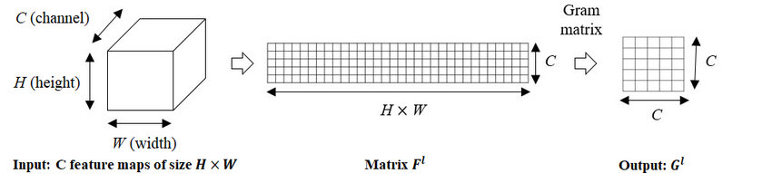
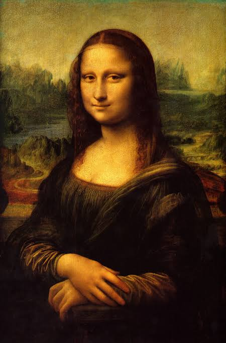
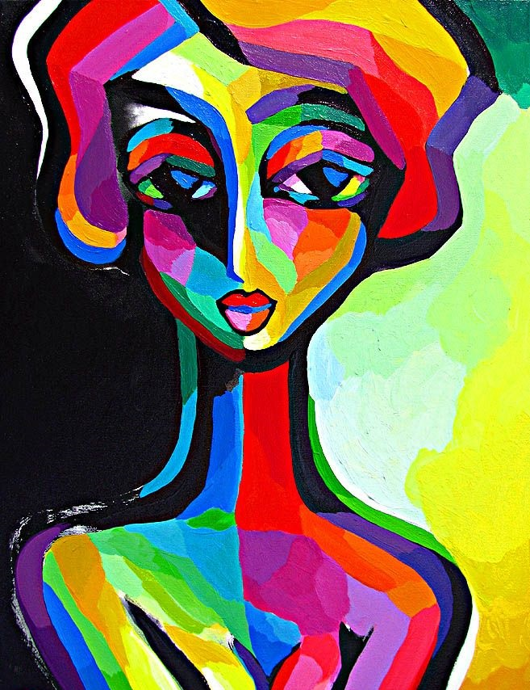
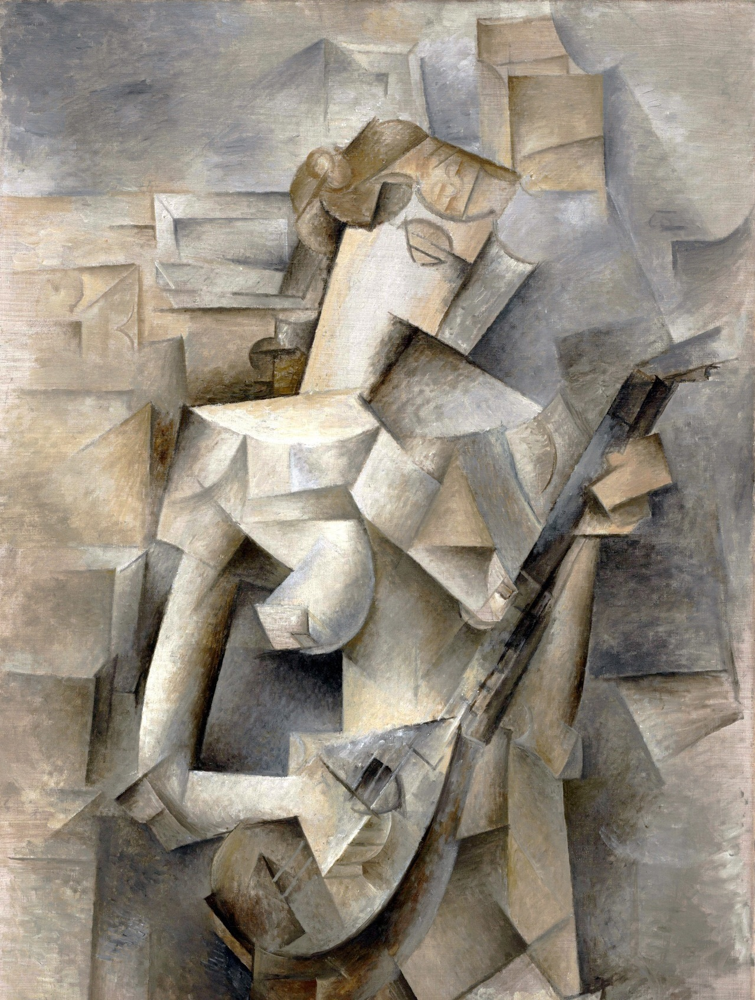
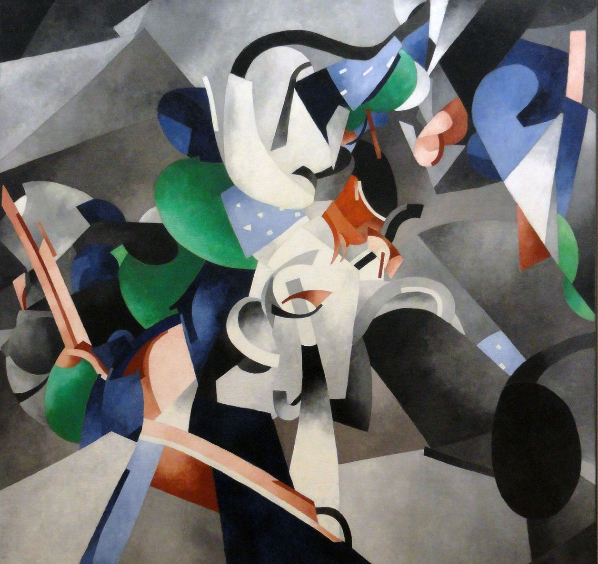

#Neural Style Transfer 
This notebook demonstrats neural style transfer as applied to art. The notebook contains the codes 
necessary  to perform a style transfer from a style image to a content image. The network considered is 
the VGG19 network.

##Preprocessing
The size of the images are rescaled to a maximum of 800 pixels but preserving the aspect ratio.

##Loss function
The given code considers three loss functions:
###Style loss
The style loss refers to the difference between the outputs of the first few convolutional layers of the 
network. In other words, the initial few layers of the network contains information on the different patterns
of the style image (also called the low level features). This kind of loss can be assesed by taking the gram
matrix of the convolutional layer.

Ths loss can be calculated by taking the euclidean distance between the outputs of the style image 
and the output image.

###Content loss
The content loss can be calculated by considering the output of the top layers. The final few layers contain
information on the high level features of the content image. The content loss is calculated by taking the 
euclidean distance between the output of the respective layers of the content image and the output image.

###Variational loss
The variational loss is the sum of the absolute differences for neighboring pixel-values in the 
input images. This measures how much noise is in the images.

##Outputs
The optimizer used is the Adam optimeizer with a learning rate of 0.02. The style weight and content weight are chosen as 100.0 and 
80.0 respectively. The optimizer is run for 1000 iterations with 10 steps per iteration. Few of the optputs are displayed below.

###Content Image 

###Style Images
  
###Output Images
  
